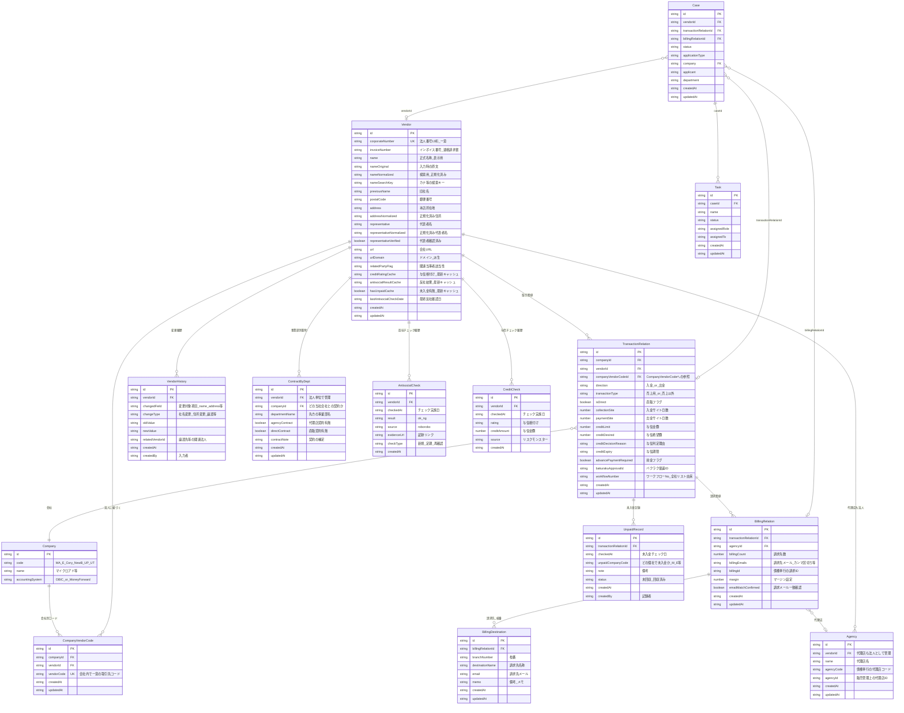
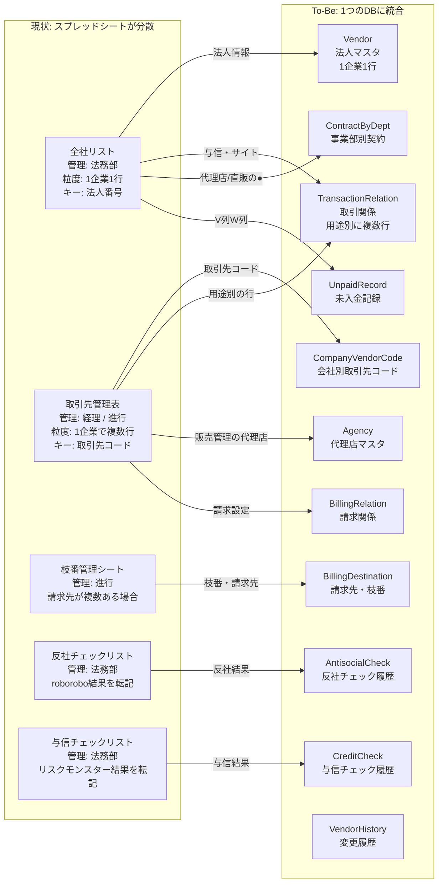
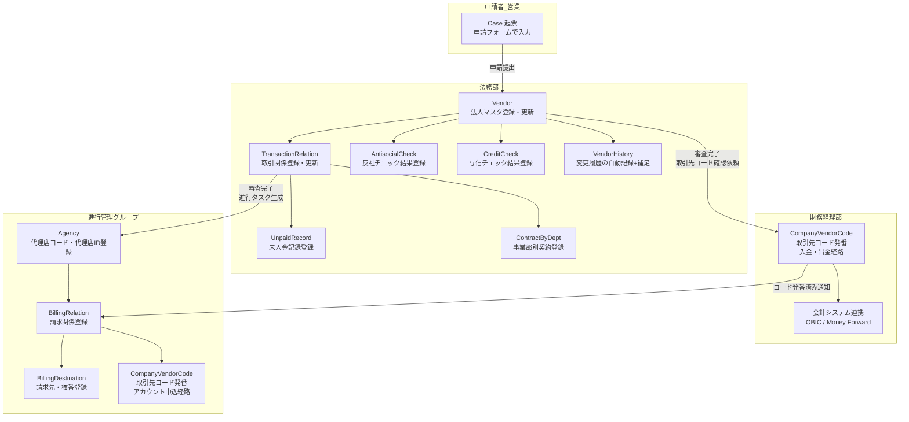
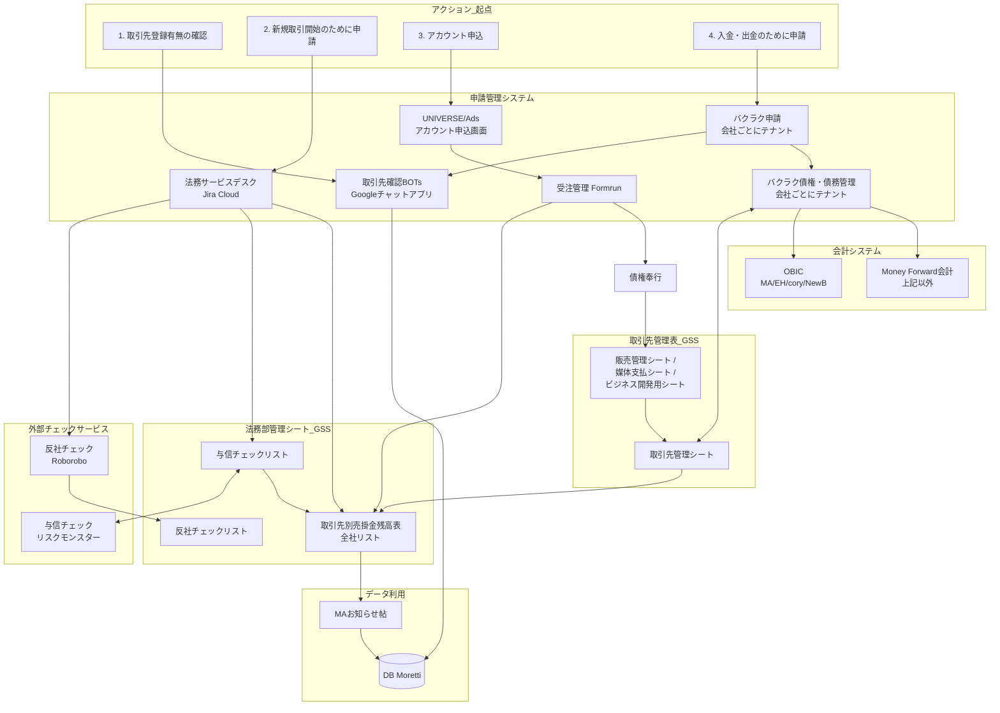
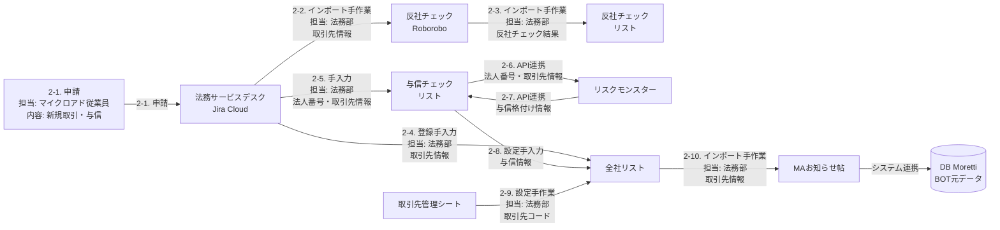
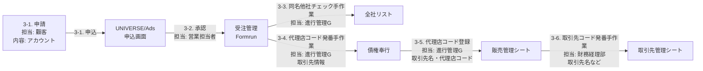
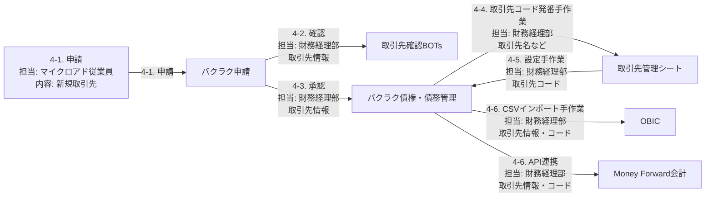
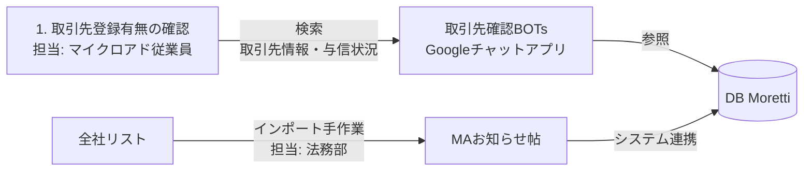

# 取引先マスタ統合 DB案と入力責任

「誰が・どこで・どの情報を入力するか」を明確にするため、取引先まわりで利用する**DB（テーブル）案**と**入力責任マトリクス**をまとめる。

---

## 1. 前提と用語

| 用語 | 説明 | 補足 |
|------|------|------|
| 取引先管理表 | 各会社毎の取引先を管理するGoogleスプレッドシート（現状）。取引先コードは**会社ごと**に発行される | 取引先管理シート／販売管理シート／媒体支払シート／ビジネス開発用シートを含む |
| 全社リスト | 法務が管理する「取引先別売掛金残高表全社統合」。**1企業1行・法人番号**で管理 | 取引先確認BOTの元データ。列に取引先名・郵便番号・住所・代表者名・法人番号・与信格付け・関連当事者該当性・ワークフローNo 等を含む |
| To-Be | 上記を**単一の取引先マスタ（DB）**に統合する。申請ナビ・バクラク・会計・BOTはすべてこのDBを参照または連携する想定 | |
| 取引先コード | 会社（MA, E, Cory 等）ごとに発行される内部管理コード。同じ法人でも会社が異なれば別コード | OBICとの連携キー |
| 代理店コード | 債権奉行で発番する代理店の識別コード。販売管理シートで管理 | 取引先コードとは別概念 |
| 代理店ID | 販売管理シート上で進行管理Gが採番する ID | 代理店コードと併せて管理 |

---

## 2. エンティティ関連図（To-Be）

---

## 3. エンティティ解説

### 3.0 全体像

本DB案は、現在2つのスプレッドシート（全社リスト＋取引先管理表）に分散している取引先情報を、**1つのデータベースに統合**するためのテーブル設計である。

現状は「法務は全社リストに1企業1行で管理」「経理は取引先管理表に用途別で複数行で管理」と粒度が異なるため、両方の粒度を共存させる構造にしている。

### 3.1 設計方針

| 方針 | 内容 |
|------|------|
| 法人単位の一元管理 | **Vendor** を法人番号で一意にし、全社リストの「1企業1行」と同等の粒度を維持する |
| 会社別コードの分離 | **CompanyVendorCode** を独立テーブルとして持つ。取引関係（TransactionRelation）が存在しない段階でも取引先コードを発番できるようにするため |
| コードの正（source of truth） | **CompanyVendorCode が正**。TransactionRelation は `companyVendorCodeId` で参照する形とし、vendorCode を直接保持しない。これにより二重管理を防ぐ |
| キャッシュ項目 | Vendor 上の `creditRatingCache` / `antisocialResultCache` / `hasUnpaidCache` は、CreditCheck / AntisocialCheck / UnpaidRecord の最新値をキャッシュしたもの。BOTや検索の高速表示用であり、**正は各履歴テーブル** |
| 事業部別契約 | **ContractByDept** は Vendor（法人）+ Company（当社会社）に紐づく。TransactionRelation ではなく法人レベルで「先方のどの事業部と契約しているか」を管理する |
| 未入金の履歴管理 | **UnpaidRecord** を新設し、毎月の未入金チェック結果を履歴として残す。TransactionRelation には最新の前金フラグ（advancePaymentRequired）のみ保持 |

---

### 3.2 Company（所属会社マスタ）

#### このテーブルは何か

マイクロアドグループ内の**自社の会社**を管理するテーブル。マイクロアド（MA）、エンハンス（E）、cory（Cory）、New B（NewB）など、グループ内の各法人を指す。

取引先（Vendor）ではなく「自社側がどの会社として取引するか」を示す。多くのテーブルで `companyId` として参照され、「どの自社会社の文脈か」を区別するために使う。

#### なぜ必要か

- 取引先コードは**会社ごとに異なる**（例：コニカミノルタの取引先コードはMAでは006792、coryでは000125）
- バクラク・OBIC・Money Forwardは**会社ごとにテナントが分かれている**
- 会計システムも会社によって異なる（MA/E/Cory/NewBはOBIC、それ以外はMoney Forward）

#### データ例

| id | code | name | accountingSystem |
|----|------|------|------------------|
| 1 | MA | マイクロアド | OBIC |
| 2 | E | エンハンス | OBIC |
| 3 | Cory | cory | OBIC |
| 4 | NewB | New B | OBIC |
| 5 | UP | （子会社名） | MoneyForward |
| 6 | UT | （子会社名） | MoneyForward |

---

### 3.3 Vendor（取引先・法人マスタ）

#### このテーブルは何か

取引のある**外部の法人**を1社1行で管理するマスタテーブル。現状の「全社リスト」の1行に相当する。法人番号（13桁）で一意に特定する。

全社リストで管理されていた取引先名・郵便番号・本店所在地・代表者名・会社URL・法人番号・関連当事者該当性などの情報がここに入る。

#### なぜ必要か

- 「1企業は1つ」という基本原則を守り、法人番号をキーにすることで**重複登録を防止**する
- 英語・カタカナ・全角・半角で同一企業が別登録されてしまう現状の課題を、正規化フィールド（`nameNormalized`）で解消する
- 取引先確認BOTの元データとなるため、法人単位で正式名称・与信状況・反社結果などを一覧できるようにする

#### 現状との関係

| 現状（全社リスト列） | Vendor フィールド |
|---------------------|-------------------|
| 取引先名 | `name`（表示用）、`nameNormalized`（検索用） |
| 法人番号 | `corporateNumber` |
| 郵便番号 | `postalCode` |
| 本店所在地 | `address` |
| 代表者名 | `representative` |
| 会社URL | `url` |
| 関連当事者該当性 | `relatedPartyFlag` |
| （現状なし） | `invoiceNumber`（インボイス番号。新規追加） |
| （現状なし） | `previousName`（旧社名。社名変更時に記録） |

#### データ例

| id | corporateNumber | name | nameNormalized | previousName |
|----|----------------|------|----------------|--------------|
| V-001 | 1234567890123 | 株式会社ＳＢＩ証券 | カフ゛シキカイシャSBIショウケン | （なし） |
| V-002 | 9876543210987 | Ａｍａｄｅｕｓ　Ｈｏｓｐｉｔａｌｉｔｙ　Ａｓｉａ　Ｐａｃｉｆｉｃ　Ｐｔｅ，　Ｌｔｄ． | AmadeusHospitalityAsiaPacificPteLtd | （なし） |
| V-003 | 1111111111111 | 大日本印刷株式会社 | タ゛イニッホ゜ンインサツカフ゛シキカイシャ | （なし） |

- **表記ゆれの例**: 法務は国税庁表記に基づき全角で「株式会社ＳＢＩ証券」と登録する。経理側で使われていた「株式会社SBI証券」（半角）は `nameOriginal` に保持しつつ、`nameNormalized` で検索時に同一法人として突合できるようにする。

#### キャッシュ項目について

Vendor には `creditRatingCache`、`antisocialResultCache`、`hasUnpaidCache` というキャッシュ項目がある。これは各履歴テーブル（CreditCheck / AntisocialCheck / UnpaidRecord）の**最新の結果を高速表示するためにコピーしたもの**であり、データの正は各履歴テーブルにある。BOTや検索一覧で「この法人の与信は？反社は？」を素早く表示するために使う。

---

### 3.4 CompanyVendorCode（会社別取引先コード）

#### このテーブルは何か

「**どの自社会社**が**どの法人**に対して**どの取引先コード**を振っているか」を管理するテーブル。現状の取引先管理表「取引先管理シート」で会社ごとに発番・管理している取引先コードに相当する。

#### なぜ必要か

- 同じ法人（例：コニカミノルタ）でも、MAでの取引先コード（006792）とcoryでの取引先コード（000125）は**別々に発番される**
- OBICとの連携はこの取引先コードをキーにして行うため、会社×法人の組み合わせでコードを管理する必要がある
- 取引関係（TransactionRelation）がまだ確定していない段階でも、取引先コードだけ先に発番したいケースがある

#### 現状との関係

現状は取引先管理表の「【全】取引先管理表タブ」でI列に社名を登録すると自動で取引先コードが採番される。この「会社ごとの取引先コード」を DB に移す。

#### データ例

| id | companyId | vendorId | vendorCode |
|----|-----------|----------|------------|
| CVC-001 | MA | V-001 | 006792 |
| CVC-002 | Cory | V-001 | 000125 |
| CVC-003 | MA | V-003 | 003456 |

- 同じ法人（V-001: SBI証券）でも、MAとcoryで別の取引先コードが存在する。

---

### 3.5 TransactionRelation（取引関係）

#### このテーブルは何か

「**どの自社会社**が**どの法人**と**どのような取引関係**にあるか」を管理するテーブル。取引の方向（入金／出金）、種別（売上用／売上以外）、与信金額、入金サイト、前金の要否などを保持する。

1つの法人（Vendor）に対して、**用途が異なれば複数の取引関係が存在**する。これが、現状の取引先管理表で「SBI証券（資金移動用）」「SBI証券（自己株）」「SBI証券（FX）」のように複数行が存在する理由に対応する。

#### なぜ必要か

- 法務の全社リストは「1企業1行」だが、経理の取引先管理表は「1企業で用途別に複数行」。この**粒度の違い**を、Vendor（1行）と TransactionRelation（複数行）で吸収する
- 与信金額・入金サイトは法人単位ではなく**取引関係単位**で設定されることがある
- 「この会社のこの取引関係で未入金がある」「この取引関係の与信期限が切れそう」といった管理ができるようになる

#### 現状との関係

| 現状 | TransactionRelation フィールド |
|------|-------------------------------|
| 全社リストの「入金サイト」列 | `collectionSite` |
| 全社リストの「決定希望金額」列 | `creditDesired` |
| 全社リストの「与信格付け」列 | `creditLimit` + CreditCheck |
| 全社リストの「ワークフローNo」列 | `workflowNumber`（移行用に保持） |
| 取引先管理表で同一企業が用途別に複数行存在 | TransactionRelation が複数レコード |

#### データ例（SBI証券の場合）

Vendor は1行（V-001: 株式会社ＳＢＩ証券）だが、TransactionRelation は用途ごとに複数存在する。

| id | companyId | vendorId | direction | transactionType | isDirect | creditLimit | memo（参考） |
|----|-----------|----------|-----------|----------------|----------|-------------|------------|
| TR-001 | MA | V-001 | 入金 | 売上用 | true | 5,000,000 | SBI証券（通常取引） |
| TR-002 | MA | V-001 | 出金 | 売上以外 | false | - | SBI証券（資金移動用） |
| TR-003 | MA | V-001 | 出金 | 売上以外 | false | - | SBI証券（自己株） |
| TR-004 | MA | V-001 | 出金 | 売上以外 | false | - | SBI証券（FX） |

---

### 3.6 Agency（代理店マスタ）

#### このテーブルは何か

広告取引において**代理店**として機能する法人の情報を管理するテーブル。代理店も外部の法人なので Vendor として登録されており、Agency は「この Vendor は代理店としても使われている」という追加情報を保持する。

代理店コード（債権奉行で発番）と代理店ID（販売管理シートで進行管理Gが採番）はそれぞれ別の番号体系であり、両方をこのテーブルで管理する。

#### なぜ必要か

- 現状、代理店コードは債権奉行、代理店IDは販売管理シートと**管理場所が分散**している
- BillingRelation（請求関係）で「この請求はどの代理店経由か」を紐づけるために、代理店のマスタが必要
- 代理店自身も取引先（Vendor）なので、法人番号で突合でき同名他社の問題を回避できる

#### データ例

| id | vendorId | name | agencyCode | agencyId |
|----|----------|------|------------|----------|
| AG-001 | V-010 | 株式会社電通デジタル | DK-001 | A-0042 |
| AG-002 | V-011 | 株式会社サイバーエージェント | DK-002 | A-0043 |

---

### 3.7 BillingRelation（請求関係）

#### このテーブルは何か

ある取引関係（TransactionRelation）に対して、**請求書をどのように発行するか**の情報を管理するテーブル。代理店経由か直販か、請求先のメールアドレス、債権奉行上の請求ID、マージン設定などを保持する。

1つの取引関係に対して、代理店が異なれば複数の請求関係が存在しうる。

#### なぜ必要か

- 請求書の発行先・発行方法は取引関係ごとに異なる
- 同じ取引先でも「代理店A経由の請求」と「直販の請求」が別々に存在するケースがある
- 債権奉行のIDと紐づけることで、請求書発行フローとの連携が可能になる

#### データ例

| id | transactionRelationId | agencyId | billingCount | billingId |
|----|-----------------------|----------|-------------|-----------|
| BR-001 | TR-001 | AG-001 | 1 | SAI-12345 |
| BR-002 | TR-001 | （なし）| 2 | SAI-12346 |

- TR-001（SBI証券との通常取引）に対して、代理店経由の請求と直販の請求が別レコードとして存在する例。

---

### 3.8 BillingDestination（請求先・枝番）

#### このテーブルは何か

1つの請求関係（BillingRelation）に対して**請求先が複数ある場合**に、それぞれの請求先を枝番で管理するテーブル。現状の枝番管理シート（01_【MA】取引先管理表）に相当する。

#### なぜ必要か

- 販売管理では請求先が複数ある場合に枝番で区別する運用が存在する（進行管理ヒアリングより）
- 現状は別のスプレッドシートで管理しており、マスタと分離しているため二重管理になっている
- 枝番ごとに備考（メモ）を残したいという要望がある

#### データ例

| id | billingRelationId | branchNumber | destinationName | email | memo |
|----|-------------------|-------------|-----------------|-------|------|
| BD-001 | BR-002 | 01 | SBI証券 経理部 | keiri@sbi.co.jp | 通常請求 |
| BD-002 | BR-002 | 02 | SBI証券 財務部 | zaimu@sbi.co.jp | 四半期まとめ請求 |

- BR-002（SBI証券への直販請求）は請求先が2つあるため、枝番01と02で管理。

---

### 3.9 ContractByDept（事業部別契約）

#### このテーブルは何か

1つの法人（Vendor）内に**複数の事業部門があり、事業部ごとに代理店契約・直販契約の有無が異なる場合**にそれを記録するテーブル。

現状の全社リストでは、AB列（代理店契約）やAC列（直販契約）に「●」を入れて法人全体としての契約有無を管理しているが、事業部ごとの区別ができないため、BOTが不正確な情報を表示してしまう課題がある。

#### なぜ必要か

法務ヒアリングの以下の課題に対応する。

> 一つの企業（例：大日本印刷）内で複数の事業部門（例：ABセンター、情報イノベーション事業部）と個別に契約を締結するケースがあるが、全社リストではその事業部門ごとの契約状況を管理・区別できていない。BOTでは代理店契約「無」と表示されるが、実際は部署によっては締結しており、法務・進行・営業間で確認の手間が発生している。

#### データ例（大日本印刷の場合）

| id | vendorId | companyId | departmentName | agencyContract | directContract | contractNote |
|----|----------|-----------|---------------|---------------|---------------|-------------|
| CD-001 | V-003 | MA | ABセンター | true | false | 2024年4月締結 |
| CD-002 | V-003 | MA | 情報イノベーション事業部 | false | true | 2023年10月締結 |

- Vendor（V-003: 大日本印刷株式会社）全体としては全社リストで「代理店契約: 無」と表示されていたが、実際はABセンターとは代理店契約済み。このテーブルによりBOTで「ABセンター: 代理店契約あり、情報イノベーション事業部: 直販契約あり」と正確に表示できる。
- **重要度は低い**（法務ヒアリングより、該当ケースが非常に少ないため）。

---

### 3.10 VendorHistory（取引先変更履歴）

#### このテーブルは何か

Vendor（法人マスタ）の**変更履歴**を記録するテーブル。社名変更・住所変更・代表者変更・事業譲渡などが発生したとき、「何が・いつ・どう変わったか」を自動または手動で記録する。

#### なぜ必要か

経理ヒアリングの以下の課題に対応する。

> 変更履歴などがわかりづらい、マスタを変えるところが複数ある。Googleスプレッドシートでマスタ管理しているため、変更履歴が追える機能がない（上書き保存対応）。

また、経理の要望として以下がある。

> 譲渡、住所変更、社名変更があった場合は、その会社のマスタにおいて変更履歴を一覧でみれたり、変更に関連する会社のマスタと関連づけできるなどあればいい

#### データ例

| id | vendorId | changedField | changeType | oldValue | newValue | relatedVendorId | createdBy |
|----|----------|-------------|-----------|----------|----------|----------------|-----------|
| VH-001 | V-020 | name | 社名変更 | ヤフー株式会社 | ＬＩＮＥヤフー株式会社 | （なし） | 法務_高平 |
| VH-002 | V-021 | name | 事業譲渡 | 旧社名A | 新社名B | V-022 | 法務_高平 |

- VH-002のように事業譲渡の場合は `relatedVendorId` に譲渡先の法人を設定し、関連づけできる。

---

### 3.11 AntisocialCheck（反社チェック履歴）

#### このテーブルは何か

各法人（Vendor）に対して実施した**反社チェックの結果**を履歴として記録するテーブル。現状の「反社チェックリスト」（Googleスプレッドシート）の「更新用」シートに相当する。

#### なぜ必要か

- 反社チェックは新規取引開始時だけでなく、**年1回の定期チェック**や**再確認**でも実施される
- いつチェックしたか、結果はOK/NGか、証跡（roboroboの結果画面リンク等）はどこか、を履歴として残す必要がある
- Vendor の `antisocialResultCache` / `lastAntisocialCheckDate` はこのテーブルの最新レコードからキャッシュされる

#### データ例

| id | vendorId | checkedAt | result | source | checkType |
|----|----------|-----------|--------|--------|-----------|
| AC-001 | V-001 | 2024-04-15 | ok | roborobo | 新規 |
| AC-002 | V-001 | 2025-01-20 | ok | roborobo | 定期 |

---

### 3.12 CreditCheck（与信チェック履歴）

#### このテーブルは何か

各法人（Vendor）に対して実施した**与信チェック（リスクモンスター等）の結果**を履歴として記録するテーブル。現状の「与信チェックリスト」（Googleスプレッドシート）に相当する。

#### なぜ必要か

- 与信チェックは新規審査時と再与信時に実施される
- 法務の要望として「与信審査リストと連携して転記の必要がなくなる形にしたい」とあり、リスクモンスターAPIの結果をこのテーブルに自動記録する想定
- 格付けや与信金額は TransactionRelation にも反映するが、**過去の審査結果を履歴として残す**ためにこのテーブルが必要

#### データ例

| id | vendorId | checkedAt | rating | creditAmount | source |
|----|----------|-----------|--------|-------------|--------|
| CC-001 | V-001 | 2024-04-15 | A | 10,000,000 | リスクモンスター |
| CC-002 | V-001 | 2025-04-10 | A | 15,000,000 | リスクモンスター |

- CC-002は再与信で与信金額が増額された履歴。TransactionRelation の `creditLimit` にはこの最新値が反映される。

---

### 3.13 UnpaidRecord（未入金記録）

#### このテーブルは何か

**毎月月初に経理から提供される未入金リスト**をもとに、どの取引関係で未入金が発生したかを記録するテーブル。現状の全社リストの V列（未入金リストチェック日）・W列（どの個社で未入金か）に相当する。

#### なぜ必要か

法務ヒアリングの以下の運用に対応する。

> 未入金が発生した場合、前金に切り替えが必要な企業の目印として記録。経理からあがってくる未入金リストをもとに、全社リストのV列、W列に情報を記入。
> （例）ＬＩＮＥヤフー株式会社とMA間の取引で未入金があった場合 → V列にチェック日、W列に"M"と記載

現状はスプレッドシートの上書きで最新値しか残らないが、このテーブルにより**過去の未入金発生と回収のタイムラインを履歴として残せる**。

#### データ例

| id | transactionRelationId | checkedAt | unpaidCompanyCode | status | note |
|----|-----------------------|-----------|-------------------|--------|------|
| UR-001 | TR-050 | 2025-01-06 | M | 未回収 | LINEヤフー MA間 |
| UR-002 | TR-050 | 2025-02-03 | M | 回収済み | 1月分回収確認 |

- TR-050（LINEヤフー株式会社とMAの取引関係）で1月に未入金が発生し、2月に回収が確認された履歴。

---

### 3.14 Case（案件）/ Task（作業）

#### このテーブルは何か

**Case** は申請ナビ上の申請案件（新規取引先申請・与信審査申請・アカウント開設申請など）を管理するテーブル。**Task** は案件に紐づく個々の作業（反社チェック・与信審査・Ads開設・請求設定など）を管理するテーブル。

これらは取引先マスタの直接的な構成要素ではなく、**マスタへの登録・更新を行うワークフローの管理単位**として存在する。申請者が Case を起票し、法務・進行がTaskを完了させることで Vendor や TransactionRelation などのマスタデータが登録・更新される。

詳細は [ワークフローとデータフロー.md](./ワークフローとデータフロー.md) と [02_フェーズ1_仕様書.md](./02_フェーズ1_仕様書.md) を参照。

---

## 4. テーブル別 入力責任一覧

「誰が・どこで・どの項目を・いつ入力するか」をテーブル単位で整理する。

### 4.1 Vendor（取引先・法人マスタ）

| 項目グループ | 入力者 | 入力場所 | 入力タイミング |
|------|--------|---------|----------------|
| corporateNumber, name, postalCode, address, representative, url | 法務部担当者 | 申請ナビ 審査画面 / 取引先マスタ画面 | 新規取引先申請の審査完了時。法人番号は国税庁表記を正とする |
| invoiceNumber | システム（API）または 法務部担当者 | 登録時に国税庁APIで自動取得。取得できない場合は手入力 | Vendor 登録時 |
| relatedPartyFlag | 法務部担当者 | 取引先マスタ画面 | 審査時に判定・設定 |
| previousName | 法務部担当者 | 取引先情報変更申請の承認時 | 社名変更が発生したとき、旧社名を記録 |
| nameNormalized, nameSearchKey, addressNormalized, urlDomain 等 | システム | 保存時に自動算出 | Vendor の登録・更新時 |
| creditRatingCache, antisocialResultCache, hasUnpaidCache | システム | CreditCheck / AntisocialCheck / UnpaidRecord の登録をトリガーに自動更新 | 各履歴テーブルへの書き込み時 |

- **参照のみ**: 取引先確認BOT、申請者（取引先検索）、進行・経理（同名他社チェック時）。

### 4.2 CompanyVendorCode（会社別取引先コード）

| 項目 | 入力者 | 入力場所 | 入力タイミング |
|------|--------|---------|----------------|
| companyId, vendorId, vendorCode | **財務経理部担当者**（入金・出金経路）または **進行管理グループ担当者**（アカウント申込経路） | 申請ナビ「取引先コード発番」画面、または進行ウィザード | 新規取引関係の確定時。バクラク申請承認後やFormrun承認後に発番 |

- **発番ルール**: 現行の会社別採番ルールを維持。会社（companyId）内で一意。
- **現状との対応**: 取引先管理表「取引先管理シート」の取引先コード列に相当。

### 4.3 TransactionRelation（取引関係）

| 項目グループ | 入力者 | 入力場所 | 入力タイミング |
|------|--------|---------|----------------|
| companyId, vendorId, direction, transactionType, isDirect | 法務部担当者 または システム | 審査完了時に自動作成、または申請ナビ上で法務が手動作成 | 新規取引先申請承認時 |
| companyVendorCodeId | 経理 または 進行 | 取引先コード発番後に紐づけ | CompanyVendorCode 発番後 |
| collectionSite, paymentSite | 法務部担当者 | 審査画面 | 審査時。全社リスト入力ルールに準拠 |
| creditLimit, creditDesired, creditDecisionReason, creditExpiry | 法務部担当者 | 与信審査結果の登録画面 | 与信審査完了時。リスクモンスターAPI連携で転記削減が望ましい |
| advancePaymentRequired | 法務部担当者 | 未入金記録の反映時 | 前金切替が必要と判断されたとき |
| bakurakuApprovalId | 財務経理部担当者 | バクラク承認後に入力 | バクラク申請承認時 |
| workflowNumber | 法務部担当者 | 審査画面 | 全社リストのワークフローNo を移行用に保持。新規登録時は Case.id で代替可 |

### 4.4 Agency（代理店）

| 項目 | 入力者 | 入力場所 | 入力タイミング |
|------|--------|---------|----------------|
| vendorId, name | 法務部担当者 | 取引先マスタ画面（代理店として登録済みの Vendor を紐づけ） | 代理店との取引開始時 |
| agencyCode | 進行管理グループ担当者 | 債権奉行で発番後、申請ナビに登録 | アカウント申込経路のステップ3-4（代理店コード発番） |
| agencyId | 進行管理グループ担当者 | 販売管理シート相当の画面で採番 | 代理店コード発番と同タイミング |

### 4.5 BillingRelation（請求関係）

| 項目 | 入力者 | 入力場所 | 入力タイミング |
|------|--------|---------|----------------|
| transactionRelationId, agencyId, billingCount | 進行管理グループ担当者 | 請求設定ウィザード / 代理店と請求画面 | UNIVERSE・Ads開設や請求設定の進行タスク完了時 |
| billingEmails, emailMatchConfirmed | 進行管理グループ担当者 | 上記同じ | 請求先メール設定・一致確認時 |
| billingId | 進行管理グループ担当者 | 債権奉行連携後に入力 | 請求書発行フローで債権奉行のIDを取得後 |
| margin | 進行管理グループ担当者 | 請求設定画面 | 請求設定時 |

### 4.6 BillingDestination（請求先・枝番）

| 項目 | 入力者 | 入力場所 | 入力タイミング |
|------|--------|---------|----------------|
| billingRelationId, branchNumber | 進行管理グループ担当者 | 請求設定画面「請求先（枝番）」セクション | 請求先が複数ある場合に枝番を採番 |
| destinationName, email, memo | 進行管理グループ担当者 | 上記同じ | 枝番登録時。新規の場合は備考にメモを残す |

- **現状との対応**: 枝番管理シート（01_【MA】取引先管理表）に相当。

### 4.7 ContractByDept（事業部別契約）

| 項目 | 入力者 | 入力場所 | 入力タイミング |
|------|--------|---------|----------------|
| vendorId, companyId, departmentName | 法務部担当者 | 取引先マスタ画面「事業部別契約」タブ | 契約締結時。事業部単位の代理店/直販契約がある場合のみ |
| agencyContract, directContract, contractNote | 法務部担当者 | 上記同じ | 締結確認後に「●」相当のフラグを設定 |

- **重要度**: 該当ケースが少ないため低い（法務ヒアリングより）。ただしBOTへの反映で問い合わせ削減が見込める。
- **BOTとの関係**: BOTが「代理店契約有無」を表示する際、ContractByDept に事業部別レコードがあればそれを優先表示し、なければ TransactionRelation.isDirect で判定する。

### 4.8 VendorHistory（取引先変更履歴）

| 項目 | 入力者 | 入力場所 | 入力タイミング |
|------|--------|---------|----------------|
| vendorId, changedField, changeType, oldValue, newValue | システム（自動） + 法務部担当者（補足） | Vendor の更新時にシステムが自動記録。法務が changeType と relatedVendorId を補足入力 | 取引先情報変更申請の承認時、またはVendor項目の更新時 |
| relatedVendorId | 法務部担当者 | 変更履歴画面 | 譲渡等で関連法人がある場合に手動設定 |

### 4.9 AntisocialCheck（反社チェック履歴）

| 項目 | 入力者 | 入力場所 | 入力タイミング |
|------|--------|---------|----------------|
| vendorId, checkedAt, result, source, evidenceUrl, checkType | 法務部担当者 または API連携 | 審査画面で roborobo 実行後、結果を登録（APIで自動取得が理想） | 新規審査時、定期チェック（年1回）、再確認時 |

- **現状との対応**: 反社チェックリスト（Googleスプレッドシート）の「更新用」シートに相当。

### 4.10 CreditCheck（与信チェック履歴）

| 項目 | 入力者 | 入力場所 | 入力タイミング |
|------|--------|---------|----------------|
| vendorId, checkedAt, rating, creditAmount, source | 法務部担当者 または API連携 | 審査画面でリスクモンスター実行後、結果を登録 | 新規審査時、再与信時 |

- **現状との対応**: 与信チェックリスト（Googleスプレッドシート）に相当。リスクモンスターAPI連携で転記不要にすることが経理・法務の要望。

### 4.11 UnpaidRecord（未入金記録）

| 項目 | 入力者 | 入力場所 | 入力タイミング |
|------|--------|---------|----------------|
| transactionRelationId, checkedAt, unpaidCompanyCode, note, status | 法務部担当者 | 未入金管理画面 | 毎月月初。経理から受領した未入金リストをもとに記録 |

- **現状との対応**: 全社リストのV列（チェック日）・W列（どの個社か）に相当。
- **運用**: 経理が未入金リストを提供 → 法務がDBに記録 → 回収済みになった場合は status を更新。履歴として残るため「いつから未入金だったか」を追跡可能。

---

## 5. アクション別 入力フロー

ユーザー資料の「アクション1〜4」ごとに、**誰がどのテーブルに何を入力するか**を整理する。

### アクション1: 取引先登録有無の確認

| ステップ | 実行者 | 操作 | 関連テーブル |
|----------|--------|------|-------------|
| 1-1 | マイクロアド従業員 | 取引先確認BOTで検索 | Vendor, TransactionRelation（**参照のみ**） |

- **入力は発生しない**。DBから取引先情報・与信状況・契約情報を検索・表示するのみ。

### アクション2: 新規取引開始のために申請

| ステップ | 実行者 | 操作 | 入力するテーブル |
|----------|--------|------|-----------------|
| 2-1 | マイクロアド従業員 | Jira（→申請ナビ）で新規取引申請 | **Case** |
| 2-2 | 法務部担当者 | roborobo に取引先情報をインポートし反社チェック実行 | **AntisocialCheck** |
| 2-3 | 法務部担当者 | 反社チェック結果を記録 | **AntisocialCheck** |
| 2-4 | 法務部担当者 | 全社リスト（→DB）に取引先情報を登録 | **Vendor** |
| 2-5〜2-7 | 法務部担当者 | リスクモンスターで与信チェック実行・結果取得 | **CreditCheck** |
| 2-8 | 法務部担当者 | 与信情報を取引関係に設定 | **TransactionRelation**（creditLimit, creditExpiry 等） |
| 2-9 | 法務部担当者 | 取引先コードを確認・設定 | **CompanyVendorCode**（既存コードがあれば紐づけ） |
| 2-10 | 法務部担当者 | MAお知らせ帖に更新通知 → BOTに反映 | Vendor のキャッシュ項目を更新（BOTはDBを参照） |

### アクション3: アカウント申込

| ステップ | 実行者 | 操作 | 入力するテーブル |
|----------|--------|------|-----------------|
| 3-1 | 顧客 | UNIVERSE・Ads申込画面で申込 | **Case** |
| 3-2 | 営業担当者 | 申込を承認 → Formrun | **Case**（ステータス更新） |
| 3-3 | 進行管理G担当者 | 同名他社チェック（全社リスト＝DB参照） | Vendor（**参照のみ**） |
| 3-4 | 進行管理G担当者 | 債権奉行で代理店コード発番 | **Agency**（agencyCode） |
| 3-5 | 進行管理G担当者 | 代理店コード・代理店IDを販売管理に登録 | **Agency**（agencyId）、**BillingRelation** |
| 3-6 | 財務経理部担当者 | 取引先コード発番 | **CompanyVendorCode** |

### アクション4: 入金・出金のために申請

| ステップ | 実行者 | 操作 | 入力するテーブル |
|----------|--------|------|-----------------|
| 4-1 | マイクロアド従業員 | バクラクで新規取引先申請 | **Case** |
| 4-2 | 財務経理部担当者 | 取引先確認BOT（DB参照）で取引先確認 | Vendor（**参照のみ**） |
| 4-3 | 財務経理部担当者 | バクラク申請を承認 | **Case**（ステータス更新） |
| 4-4 | 財務経理部担当者 | 取引先コード発番 | **CompanyVendorCode** |
| 4-5 | 財務経理部担当者 | バクラク債権・債務に取引先コードを設定 | （外部システム。DB上は CompanyVendorCode の参照） |
| 4-6 | 財務経理部担当者 | OBIC / MFA に取引先情報をCSV/API連携 | （外部システム連携） |

---

## 6. 外部システムとの連携

| 外部システム | 連携方向 | 連携内容 | 入力責任 |
|--------------|----------|----------|----------|
| 取引先確認BOT（Moretti） | DB → BOT | 取引先・与信・契約情報を表示 | BOTは**参照のみ**。入力は申請ナビ（DB）側 |
| 法務サービスデスク（Jira） | Jira → DB | 申請受付 | To-Beでは申請ナビが窓口。Jiraからの申請内容は Case に取り込む |
| 反社チェック（roborobo） | DB ↔ roborobo | 取引先情報を送信、結果を受信 | 法務が実行。結果は **AntisocialCheck** に記録 |
| 与信チェック（リスクモンスター） | DB ↔ リスクモンスター | 法人番号等を送信、格付け結果を受信 | 法務が実行。結果は **CreditCheck** + TransactionRelation に記録 |
| 受注管理（Formrun） | Formrun → DB | アカウント申込受付 | 承認後、進行が Agency / BillingRelation / CompanyVendorCode を登録 |
| バクラク申請・債権債務 | DB ↔ バクラク | 取引先情報の参照・取引先コードの設定 | 経理がDBで確認後、バクラクに設定。**入力の正はDB** |
| 債権奉行 | DB ↔ 債権奉行 | 代理店コード発番・請求書ID | 進行が発番後 Agency.agencyCode と BillingRelation.billingId に記録 |
| OBIC / Money Forward会計 | DB → 会計 | 取引先名・取引先コードをCSV/API連携 | **入力はDB側1回**。会計側は受取のみ |
| 国税庁API | API → DB | 法人番号→インボイス番号の自動取得 | Vendor 登録時にシステムが自動取得 |

---

## 7. 入力責任サマリ（部署×テーブル）

### 部署別の責任範囲まとめ

| 部署 | 入力するテーブル | 入力しないテーブル |
|------|-----------------|-------------------|
| **申請者（営業）** | Case（起票・申請内容） | Vendor 以下すべて（参照のみ） |
| **法務部** | Vendor, TransactionRelation, AntisocialCheck, CreditCheck, UnpaidRecord, ContractByDept, VendorHistory | CompanyVendorCode, Agency, BillingRelation, BillingDestination |
| **財務経理部** | CompanyVendorCode（入金・出金経路） | Vendor, TransactionRelation（参照のみ） |
| **進行管理グループ** | Agency, BillingRelation, BillingDestination, CompanyVendorCode（アカウント申込経路） | Vendor, TransactionRelation（参照のみ） |

---

## 8. 現状の課題との対応

ヒアリングで挙がった各課題が、本DB案でどのように解決されるかを整理する。

| 課題 | 言及部署 | DB案での解決方法 |
|------|----------|-----------------|
| 登録内容を3箇所で更新する必要がある | 経理 | **DBを単一の正とし、バクラク・会計・BOTは連携で受け取る**。入力は1箇所に集約 |
| 変更履歴が追えない（上書き保存） | 経理 | **VendorHistory** でフィールド単位の変更を自動記録。関連法人との紐づけも可能 |
| 重複登録（英語/カタカナで同一企業） | 経理 | **法人番号での一意制約** + nameNormalized / nameSearchKey による類似度チェック強化 |
| 登録粒度の不統一（法務1行 vs 経理複数行） | 法務 | **Vendor（1法人1行）** + **CompanyVendorCode / TransactionRelation（用途別に複数）** で両方の粒度を共存 |
| 事業部別契約がBOTに反映されない | 法務・進行 | **ContractByDept** を Vendor に紐づけ、BOTがこのテーブルを参照して表示 |
| 取引先名の表記ゆれ（全角/半角） | 法務 | **nameOriginal**（入力時原文）と **nameNormalized**（正規化済み）を分離。表記ルールを統一し、法人番号をマッチキーとする |
| 同名他社の判別に2シートを跨ぐ必要がある | 進行 | **Vendor の法人番号**で一意特定。同名の場合は法人番号を併記して区別（1テーブル内で完結） |
| 枝番の管理が別シート | 進行 | **BillingDestination** で請求先ごとの枝番・備考を一元管理。別シート不要 |
| インボイス番号を手動で調べている | 経理 | **Vendor.invoiceNumber** を国税庁APIで自動取得（可能な場合） |
| スプレッドシートが重い | 法務・進行 | **DB化**により、閲覧は軽量なビュー/検索画面で行う。一括編集はバッチ処理 |
| 与信審査リストとの転記 | 法務 | **CreditCheck** にリスクモンスターAPI結果を自動記録。TransactionRelation への転記もシステムが実施 |
| 未入金の記録が最新のみ | 法務 | **UnpaidRecord** で月次の履歴を保持。いつ発生・いつ回収済みかを追跡可能 |

---

## 9. 現状の業務フロー図（As-Is）

最初のヒアリングで整理したアクション1〜4の業務フロー図をMermaid形式で記載する。Figma等のMermaid対応ツールでそのまま利用可能。

### 9.1 システム全体像

登場するシステム・シート・外部サービスの全体像。

### 9.2 アクション2: 新規取引開始のために申請（詳細）

法務部が中心となる新規取引先の審査・登録フロー。

### 9.3 アクション3: アカウント申込（詳細）

顧客の申込 → 営業承認 → 進行管理Gと経理が処理するフロー。

### 9.4 アクション4: 入金・出金のために申請（詳細）

経理部が中心となる取引先コード発番・会計連携フロー。

### 9.5 アクション1: 取引先登録有無の確認（詳細）

参照のみのフロー。入力は発生しない。

---

## 10. 今後の検討事項

| 項目 | 内容 | 優先度 |
|------|------|--------|
| インボイス番号の自動取得 | 国税庁API（法人番号→適格請求書発行事業者番号）の可否を調査し、Vendor 登録時に自動セットする仕組みを検討 | 中 |
| 与信チェックAPI連携 | リスクモンスターの結果を CreditCheck + TransactionRelation に自動反映する仕組み | 高 |
| 反社チェックAPI連携 | roborobo の結果を AntisocialCheck に自動反映する仕組み | 高 |
| 枝番の採番ルール | 現行ルールを踏襲するか新ルールを定義するか。BillingDestination のbranchNumber の採番ロジック | 中 |
| 既存データの移行 | 全社リスト・取引先管理表の既存データを本DBに移行する際の表記ゆれ解消・法人番号突合の手順 | 高 |
| BOTのデータソース切替 | Moretti/MAお知らせ帖のインポート元を全社リスト（スプシ）から本DBに切り替える手順 | 中 |
| ContractByDept の運用開始タイミング | 該当ケースが少ないため、初期リリース後に段階導入でもよい | 低 |
