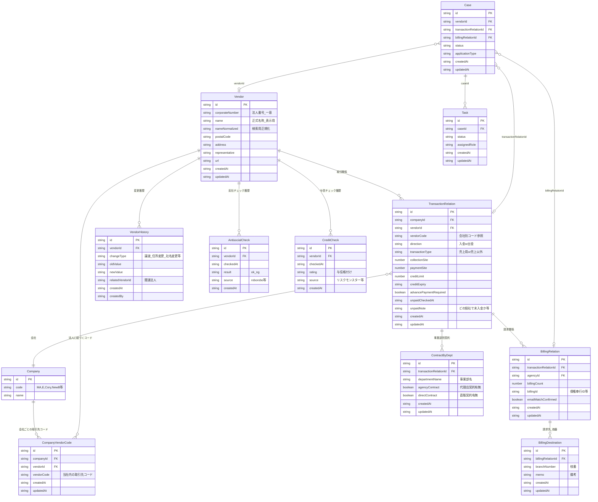
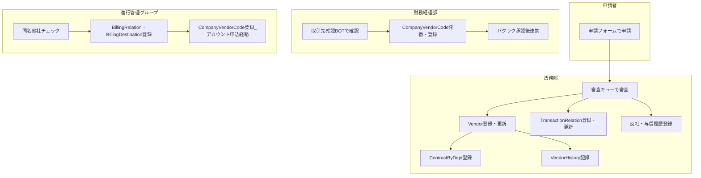

# 取引先マスタ統合 DB案と入力責任

「誰が・どこで・どの情報を入力するか」を明確にするため、取引先まわりで利用する**DB（テーブル）案**と**入力責任マトリクス**をまとめる。

---

## 1. 前提と用語

- **取引先管理表**: 各会社毎の取引先を管理するGoogleスプレッドシート（現状）。取引先コードは**会社ごと**に発行される。
- **全社リスト**: 法務が管理する「取引先別売掛金残高表全社統合」。**1企業1行・法人番号**で管理。取引先確認BOTの元データ。
- **To-Be**: 上記を**単一の取引先マスタ（DB）**に統合し、申請ナビ・バクラク・会計・BOTはすべてこのDBを参照または連携する形を想定する。

---

## 2. エンティティ関連図（To-Be）

- **Vendor**: 法人単位のマスタ（全社リストの「1企業1行」に相当）。法人番号で一意化。
- **CompanyVendorCode**: 会社×取引先ごとの**取引先コード**（現状の取引先管理表の「取引先コード」を一元管理）。
- **TransactionRelation**: 会社×取引先×入金/出金×売上/売上以外の**取引関係**。与信・入金サイト・未入金記録を含む。
- **BillingRelation**: 取引関係に紐づく**請求関係**（代理店・請求先数・債権奉行ID等）。
- **BillingDestination**: 請求先が複数ある場合の**枝番**と備考（現状の枝番管理シートに相当）。
- **ContractByDept**: 同一法人内の**事業部別**の代理店契約・直販契約の有無（法務・進行の要望に対応）。
- **VendorHistory**: 譲渡・住所変更・社名変更などの**変更履歴**。
- **AntisocialCheck / CreditCheck**: 反社・与信の**履歴**（誰がいつどの結果を登録したか）。

---

## 3. テーブル別 入力責任一覧

「誰が・どこで・どの項目を・いつ入力するか」をテーブル単位で整理する。

### 3.1 Vendor（取引先・法人マスタ）

| 項目 | 入力者 | 入力場所（画面・プロセス） | 入力タイミング |
|------|--------|----------------------------|----------------|
| corporateNumber | 法務部担当者 | 審査完了時の取引先登録画面（申請ナビ）／Jira申請内容の転記 | 新規取引先申請の審査完了時。法人番号は国税庁表記を転記（全角ルールを適用可） |
| name | 法務部担当者 | 上記同じ | 審査完了時。正式名称（表記ルールは全社で1つに統一） |
| postalCode, address, representative, url | 法務部担当者 | 上記同じ | 審査完了時。変更申請の場合は取引先情報変更申請の承認後に法務が更新 |
| nameNormalized 等の派生項目 | システム | 登録・更新時のバッチまたはAPI | 保存時に自動算出 |

- **参照のみ（入力しない）**: 取引先確認BOT、申請者（取引先検索）、進行・経理（コード発番時の同名他社チェック）。

### 3.2 CompanyVendorCode（会社別取引先コード）

| 項目 | 入力者 | 入力場所（画面・プロセス） | 入力タイミング |
|------|--------|----------------------------|----------------|
| companyId, vendorId, vendorCode | 財務経理部担当者 または 進行管理グループ担当者 | 申請ナビ「取引先マスタ」画面の「会社別コード」タブ、または進行ウィザード（請求設定・代理店コード発番後） | 新規取引関係が確定したタイミングで、当社の取引先コードを発番・登録。バクラク申請承認後（入金・出金申請）や、Formrun承認後（アカウント申込経路）で発番 |

- **現状の対応**: 取引先管理表の「取引先管理シート」で発行している取引先コードを、DBの `CompanyVendorCode` に登録する形に移行。発番ルールは現行の会社別採番を維持。

### 3.3 TransactionRelation（取引関係）

| 項目 | 入力者 | 入力場所（画面・プロセス） | 入力タイミング |
|------|--------|----------------------------|----------------|
| companyId, vendorId, direction, transactionType | 法務部担当者 または システム | 審査完了時の取引関係登録、または申請内容から自動作成 | 新規取引先申請承認時。入金・出金はバクラク申請承認後に進行・経理が紐づける場合あり |
| vendorCode | 財務経理部 または 進行 | 取引関係登録画面で会社別コードを選択／登録 | 取引先コード発番後 |
| collectionSite, paymentSite | 法務部担当者 | 審査画面・取引先マスタ画面 | 審査時または全社リスト入力ルールに準拠 |
| creditLimit, creditExpiry, creditDecisionReason | 法務部担当者 | 与信審査結果の登録画面。可能なら与信チェックAPI連携で自動取得 | 与信審査完了時。与信チェックリスト（リスクモンスター）連携で転記削減 |
| advancePaymentRequired, unpaidCheckedAt, unpaidNote | 法務部担当者 または 経理 | 未入金リスト反映画面（毎月月初） | 経理から未入金リストを受領後、法務が記録 |
| bakurakuApprovalId | 財務経理部担当者 | バクラク承認後に入力または連携 | バクラク申請承認時 |

### 3.4 BillingRelation（請求関係）

| 項目 | 入力者 | 入力場所（画面・プロセス） | 入力タイミング |
|------|--------|----------------------------|----------------|
| transactionRelationId, agencyId, billingCount, billingEmails | 進行管理グループ担当者 | 請求設定ウィザード、代理店と請求画面 | UNIVERSE・Ads開設や請求設定の進行タスク完了時。債権奉行の代理店コード発番と連動 |
| billingId（債権奉行ID） | 進行管理グループ担当者 | 上記同じ | 請求書発行フローで債権奉行と連携する場合 |
| emailMatchConfirmed | 進行管理グループ担当者 | 上記同じ | 請求先メール一致確認時 |

### 3.5 BillingDestination（請求先・枝番）

| 項目 | 入力者 | 入力場所（画面・プロセス） | 入力タイミング |
|------|--------|----------------------------|----------------|
| billingRelationId, branchNumber, memo | 進行管理グループ担当者 | 請求設定画面の「請求先（枝番）」タブ | 請求先が複数ある場合に枝番を採番し、備考を入力。新規は備考にメモを残せるようにする |

### 3.6 ContractByDept（事業部別契約）

| 項目 | 入力者 | 入力場所（画面・プロセス） | 入力タイミング |
|------|--------|----------------------------|----------------|
| transactionRelationId, departmentName, agencyContract, directContract | 法務部担当者 | 取引先マスタ画面の「事業部別契約」タブ、または契約締結申請完了時 | 代理店契約・直販契約の締結申請が完了したタイミング。該当ケースは少ないため重要度は低い |

### 3.7 VendorHistory（取引先変更履歴）

| 項目 | 入力者 | 入力場所（画面・プロセス） | 入力タイミング |
|------|--------|----------------------------|----------------|
| vendorId, changeType, oldValue, newValue, relatedVendorId | 法務部担当者 または システム | 取引先情報変更申請の承認時に入力、または取引先マスタ更新時にシステムが自動記録 | 譲渡・住所変更・社名変更などが発生したとき。関連法人がある場合は relatedVendorId を設定 |

### 3.8 AntisocialCheck / CreditCheck（反社・与信履歴）

| 項目 | 入力者 | 入力場所（画面・プロセス） | 入力タイミング |
|------|--------|----------------------------|----------------|
| vendorId, checkedAt, result, source | 法務部担当者 または API連携 | 審査画面で反社・与信実行後、結果を登録。可能なら roborobo・リスクモンスターのAPI結果を自動記録 | 新規審査時・再与信時・定期反社チェック時。与信審査リストと連携して転記不要にすることが要望 |

---

## 4. アクション別 入力フローとの対応

貴社資料の「アクション1〜4」と、上記DBの**どこで誰が入力するか**の対応を整理する。

| アクション | 主な入力者 | 入力するテーブル（項目） | 入力する画面・ツール（To-Be） |
|------------|------------|---------------------------|-------------------------------|
| 1. 取引先登録有無の確認 | マイクロアド従業員は参照のみ | 入力なし（Vendor / TransactionRelation を参照） | 取引先確認BOT（Moretti）→ DBから検索・参照 |
| 2. 新規取引開始のために申請 | 申請者→法務部 | Case → Vendor, TransactionRelation, AntisocialCheck, CreditCheck | 申請: 申請フォーム（申請ナビ）。登録: 法務の審査完了時に Vendor / TransactionRelation / 反社・与信履歴を登録。取引先コードは法務または経理が CompanyVendorCode に登録 |
| 3. アカウント申込 | 顧客→営業承認→進行 | Case, BillingRelation, BillingDestination, CompanyVendorCode | 申込: UNIVERSE・Ads申込画面。承認後、進行が同名他社チェック（Vendor参照）→ 代理店コード発番→ 取引先コード発番（CompanyVendorCode 登録）→ 販売管理用の請求関係（BillingRelation / BillingDestination）を登録 |
| 4. 入金・出金のために申請 | 申請者→財務経理部 | CompanyVendorCode, TransactionRelation（必要に応じ）, 会計システム連携 | バクラク申請 → 経理が取引先確認（DB参照）→ 取引先コード発番・設定（CompanyVendorCode）→ バクラク債権債務 → OBIC/MFA に取引先コード・名称を連携 |

- 現状の「取引先管理表」「全社リスト」への手入力・手作業は、上記の**申請ナビ（または統合マスタ画面）での登録**に置き換え、**入力は1箇所**に集約する。

---

## 5. 外部システムとの連携と入力の関係

| 外部システム | 連携内容 | 入力責任の考え方 |
|--------------|----------|------------------|
| 取引先確認BOT（Moretti） | DBから取引先・与信・契約情報を読み取り表示 | DBが正なので、BOTは**参照のみ**。入力は申請ナビ側で行う |
| 法務サービスデスク（Jira） | 申請受付。To-Beでは申請ナビが申請窓口になり、Jiraは経路の一つまたは廃止 | 申請内容は申請ナビの Case に入り、法務は申請ナビ上で審査・Vendor/TransactionRelation 登録 |
| 反社チェック（roborobo） | 反社結果を取得 | 法務が審査画面で実行し、結果を **AntisocialCheck** に登録（またはAPIで自動記録） |
| 与信チェック（リスクモンスター） | 与信格付けを取得 | 法務が与信チェック実行し、結果を **CreditCheck** と TransactionRelation の与信項目に登録（またはAPIで自動記録） |
| 受注管理（Formrun） | アカウント申込の受付 | 承認後、進行が申請ナビ上で取引先コード発番・BillingRelation 登録。Formrun には受付番号など参照用IDを連携 |
| バクラク申請・債権債務 | 入金・出金の稟議・取引先 | 経理が取引先をDBで確認し、CompanyVendorCode を登録したうえでバクラクに設定。承認後は債権債務に連携 |
| 債権奉行 | 請求書・代理店コード | 進行が BillingRelation に代理店コード・請求先を登録。債権奉行とのIDは billingId で保持 |
| OBIC / Money Forward会計 | 取引先マスタ・取引先コード | DBの Vendor + CompanyVendorCode をCSV/APIで連携。**入力はDB側1回**とし、会計側は連携受取のみ |

---

## 6. 入力責任のまとめ（誰がどこで何をするか）

- **申請者**: 申請フォームで案件（Case）と申請内容を入力。取引先・与信の**登録はしない**。
- **法務部**: 審査完了後に **Vendor / TransactionRelation / 反社・与信履歴 / 事業部別契約 / 変更履歴** を登録・更新。入力場所は**申請ナビの審査画面・取引先マスタ画面**。
- **財務経理部**: **取引先コード（CompanyVendorCode）** の発番・登録、バクラク・会計への連携。取引先確認はDB参照のみ。
- **進行管理グループ**: **請求関係（BillingRelation）・請求先枝番（BillingDestination）** の登録、アカウント申込経路での**取引先コード（CompanyVendorCode）** 登録。同名他社の判別はDBのVendor（法人番号）を参照。

---

## 7. 今後の検討事項

- **インボイス番号**: 国税庁API等で取得可能であれば、Vendor に項目を追加し、登録時または定期バッチで自動取得する案を検討する。
- **与信審査リストとの連携**: 与信チェック結果をAPIまたはファイル連携で DB に自動反映し、法務の転記作業をなくす。
- **枝番の採番ルール**: 現行の別シート管理をやめ、BillingDestination で一元的に管理する。採番ルールは現行を踏襲するか、新ルールを定義する。

以上で、「誰が・どこで・どの情報を入力するか」をDB案と紐づけて整理した。
