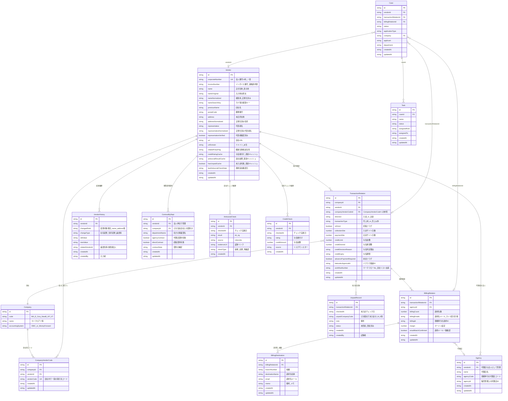

# 取引先マスタ統合 DB案と入力責任

「誰が・どこで・どの情報を入力するか」を明確にするため、取引先まわりで利用する**DB（テーブル）案**と**入力責任マトリクス**をまとめる。

---

## 1. 前提と用語

| 用語 | 説明 | 補足 |
|------|------|------|
| 取引先管理表 | 各会社毎の取引先を管理するGoogleスプレッドシート（現状）。取引先コードは**会社ごと**に発行される | 取引先管理シート／販売管理シート／媒体支払シート／ビジネス開発用シートを含む |
| 全社リスト | 法務が管理する「取引先別売掛金残高表全社統合」。**1企業1行・法人番号**で管理 | 取引先確認BOTの元データ。列に取引先名・郵便番号・住所・代表者名・法人番号・与信格付け・関連当事者該当性・ワークフローNo 等を含む |
| To-Be | 上記を**単一の取引先マスタ（DB）**に統合する。申請ナビ・バクラク・会計・BOTはすべてこのDBを参照または連携する想定 | |
| 取引先コード | 会社（MA, E, Cory 等）ごとに発行される内部管理コード。同じ法人でも会社が異なれば別コード | OBICとの連携キー |
| 代理店コード | 債権奉行で発番する代理店の識別コード。販売管理シートで管理 | 取引先コードとは別概念 |
| 代理店ID | 販売管理シート上で進行管理Gが採番する ID | 代理店コードと併せて管理 |

---

## 2. エンティティ関連図（To-Be）

---

## 3. エンティティ解説

### 3.1 設計方針

| 方針 | 内容 |
|------|------|
| 法人単位の一元管理 | **Vendor** を法人番号で一意にし、全社リストの「1企業1行」と同等の粒度を維持する |
| 会社別コードの分離 | **CompanyVendorCode** を独立テーブルとして持つ。取引関係（TransactionRelation）が存在しない段階でも取引先コードを発番できるようにするため |
| コードの正（source of truth） | **CompanyVendorCode が正**。TransactionRelation は `companyVendorCodeId` で参照する形とし、vendorCode を直接保持しない。これにより二重管理を防ぐ |
| キャッシュ項目 | Vendor 上の `creditRatingCache` / `antisocialResultCache` / `hasUnpaidCache` は、CreditCheck / AntisocialCheck / UnpaidRecord の最新値をキャッシュしたもの。BOTや検索の高速表示用であり、**正は各履歴テーブル** |
| 事業部別契約 | **ContractByDept** は Vendor（法人）+ Company（当社会社）に紐づく。TransactionRelation ではなく法人レベルで「先方のどの事業部と契約しているか」を管理する |
| 未入金の履歴管理 | **UnpaidRecord** を新設し、毎月の未入金チェック結果を履歴として残す。TransactionRelation には最新の前金フラグ（advancePaymentRequired）のみ保持 |

### 3.2 各エンティティの役割

| エンティティ | 現状の対応先 | 役割 |
|--------------|-------------|------|
| **Vendor** | 全社リストの1行 | 法人マスタ。法人番号・正式名称・住所・代表者・インボイス番号・関連当事者該当性 |
| **CompanyVendorCode** | 取引先管理表の取引先コード | 会社×法人ごとの取引先コード。OBICとの連携キー |
| **TransactionRelation** | 全社リストの与信・入金サイト列 + 取引先管理表の各タブ | 会社×法人×入金/出金×売上/売上以外の取引関係。与信・サイト・前金フラグ |
| **Agency** | 販売管理シートの代理店ID + 債権奉行の代理店コード | 代理店マスタ。代理店も法人（Vendor）として登録し、代理店コード・代理店IDを保持 |
| **BillingRelation** | 取引先管理表の販売管理シート列 | 取引関係に紐づく請求関係。代理店・請求先数・債権奉行ID・マージン |
| **BillingDestination** | 枝番管理シート（01_【MA】取引先管理表） | 請求先が複数ある場合の枝番・請求先名称・備考 |
| **ContractByDept** | 全社リスト（AB,AC列の代理店/直販「●」）の事業部拡張 | 先方の事業部門ごとの契約有無。BOTに反映する想定 |
| **VendorHistory** | （現状なし＝スプシの上書きで消失） | 社名変更・住所変更・譲渡などの変更履歴。関連法人の紐づけ |
| **AntisocialCheck** | 反社チェックリスト（Googleスプレッドシート） | 反社チェックの実施日・結果・証跡。新規・定期・再確認の区別 |
| **CreditCheck** | 与信チェックリスト（Googleスプレッドシート） | 与信チェックの実施日・格付け・金額 |
| **UnpaidRecord** | 全社リストのV列（チェック日）・W列（個社） | 未入金チェックの履歴。月次で追記し、回収済みかどうかを記録 |

---

## 4. テーブル別 入力責任一覧

「誰が・どこで・どの項目を・いつ入力するか」をテーブル単位で整理する。

### 4.1 Vendor（取引先・法人マスタ）

| 項目グループ | 入力者 | 入力場所 | 入力タイミング |
|------|--------|---------|----------------|
| corporateNumber, name, postalCode, address, representative, url | 法務部担当者 | 申請ナビ 審査画面 / 取引先マスタ画面 | 新規取引先申請の審査完了時。法人番号は国税庁表記を正とする |
| invoiceNumber | システム（API）または 法務部担当者 | 登録時に国税庁APIで自動取得。取得できない場合は手入力 | Vendor 登録時 |
| relatedPartyFlag | 法務部担当者 | 取引先マスタ画面 | 審査時に判定・設定 |
| previousName | 法務部担当者 | 取引先情報変更申請の承認時 | 社名変更が発生したとき、旧社名を記録 |
| nameNormalized, nameSearchKey, addressNormalized, urlDomain 等 | システム | 保存時に自動算出 | Vendor の登録・更新時 |
| creditRatingCache, antisocialResultCache, hasUnpaidCache | システム | CreditCheck / AntisocialCheck / UnpaidRecord の登録をトリガーに自動更新 | 各履歴テーブルへの書き込み時 |

- **参照のみ**: 取引先確認BOT、申請者（取引先検索）、進行・経理（同名他社チェック時）。

### 4.2 CompanyVendorCode（会社別取引先コード）

| 項目 | 入力者 | 入力場所 | 入力タイミング |
|------|--------|---------|----------------|
| companyId, vendorId, vendorCode | **財務経理部担当者**（入金・出金経路）または **進行管理グループ担当者**（アカウント申込経路） | 申請ナビ「取引先コード発番」画面、または進行ウィザード | 新規取引関係の確定時。バクラク申請承認後やFormrun承認後に発番 |

- **発番ルール**: 現行の会社別採番ルールを維持。会社（companyId）内で一意。
- **現状との対応**: 取引先管理表「取引先管理シート」の取引先コード列に相当。

### 4.3 TransactionRelation（取引関係）

| 項目グループ | 入力者 | 入力場所 | 入力タイミング |
|------|--------|---------|----------------|
| companyId, vendorId, direction, transactionType, isDirect | 法務部担当者 または システム | 審査完了時に自動作成、または申請ナビ上で法務が手動作成 | 新規取引先申請承認時 |
| companyVendorCodeId | 経理 または 進行 | 取引先コード発番後に紐づけ | CompanyVendorCode 発番後 |
| collectionSite, paymentSite | 法務部担当者 | 審査画面 | 審査時。全社リスト入力ルールに準拠 |
| creditLimit, creditDesired, creditDecisionReason, creditExpiry | 法務部担当者 | 与信審査結果の登録画面 | 与信審査完了時。リスクモンスターAPI連携で転記削減が望ましい |
| advancePaymentRequired | 法務部担当者 | 未入金記録の反映時 | 前金切替が必要と判断されたとき |
| bakurakuApprovalId | 財務経理部担当者 | バクラク承認後に入力 | バクラク申請承認時 |
| workflowNumber | 法務部担当者 | 審査画面 | 全社リストのワークフローNo を移行用に保持。新規登録時は Case.id で代替可 |

### 4.4 Agency（代理店）

| 項目 | 入力者 | 入力場所 | 入力タイミング |
|------|--------|---------|----------------|
| vendorId, name | 法務部担当者 | 取引先マスタ画面（代理店として登録済みの Vendor を紐づけ） | 代理店との取引開始時 |
| agencyCode | 進行管理グループ担当者 | 債権奉行で発番後、申請ナビに登録 | アカウント申込経路のステップ3-4（代理店コード発番） |
| agencyId | 進行管理グループ担当者 | 販売管理シート相当の画面で採番 | 代理店コード発番と同タイミング |

### 4.5 BillingRelation（請求関係）

| 項目 | 入力者 | 入力場所 | 入力タイミング |
|------|--------|---------|----------------|
| transactionRelationId, agencyId, billingCount | 進行管理グループ担当者 | 請求設定ウィザード / 代理店と請求画面 | UNIVERSE・Ads開設や請求設定の進行タスク完了時 |
| billingEmails, emailMatchConfirmed | 進行管理グループ担当者 | 上記同じ | 請求先メール設定・一致確認時 |
| billingId | 進行管理グループ担当者 | 債権奉行連携後に入力 | 請求書発行フローで債権奉行のIDを取得後 |
| margin | 進行管理グループ担当者 | 請求設定画面 | 請求設定時 |

### 4.6 BillingDestination（請求先・枝番）

| 項目 | 入力者 | 入力場所 | 入力タイミング |
|------|--------|---------|----------------|
| billingRelationId, branchNumber | 進行管理グループ担当者 | 請求設定画面「請求先（枝番）」セクション | 請求先が複数ある場合に枝番を採番 |
| destinationName, email, memo | 進行管理グループ担当者 | 上記同じ | 枝番登録時。新規の場合は備考にメモを残す |

- **現状との対応**: 枝番管理シート（01_【MA】取引先管理表）に相当。

### 4.7 ContractByDept（事業部別契約）

| 項目 | 入力者 | 入力場所 | 入力タイミング |
|------|--------|---------|----------------|
| vendorId, companyId, departmentName | 法務部担当者 | 取引先マスタ画面「事業部別契約」タブ | 契約締結時。事業部単位の代理店/直販契約がある場合のみ |
| agencyContract, directContract, contractNote | 法務部担当者 | 上記同じ | 締結確認後に「●」相当のフラグを設定 |

- **重要度**: 該当ケースが少ないため低い（法務ヒアリングより）。ただしBOTへの反映で問い合わせ削減が見込める。
- **BOTとの関係**: BOTが「代理店契約有無」を表示する際、ContractByDept に事業部別レコードがあればそれを優先表示し、なければ TransactionRelation.isDirect で判定する。

### 4.8 VendorHistory（取引先変更履歴）

| 項目 | 入力者 | 入力場所 | 入力タイミング |
|------|--------|---------|----------------|
| vendorId, changedField, changeType, oldValue, newValue | システム（自動） + 法務部担当者（補足） | Vendor の更新時にシステムが自動記録。法務が changeType と relatedVendorId を補足入力 | 取引先情報変更申請の承認時、またはVendor項目の更新時 |
| relatedVendorId | 法務部担当者 | 変更履歴画面 | 譲渡等で関連法人がある場合に手動設定 |

### 4.9 AntisocialCheck（反社チェック履歴）

| 項目 | 入力者 | 入力場所 | 入力タイミング |
|------|--------|---------|----------------|
| vendorId, checkedAt, result, source, evidenceUrl, checkType | 法務部担当者 または API連携 | 審査画面で roborobo 実行後、結果を登録（APIで自動取得が理想） | 新規審査時、定期チェック（年1回）、再確認時 |

- **現状との対応**: 反社チェックリスト（Googleスプレッドシート）の「更新用」シートに相当。

### 4.10 CreditCheck（与信チェック履歴）

| 項目 | 入力者 | 入力場所 | 入力タイミング |
|------|--------|---------|----------------|
| vendorId, checkedAt, rating, creditAmount, source | 法務部担当者 または API連携 | 審査画面でリスクモンスター実行後、結果を登録 | 新規審査時、再与信時 |

- **現状との対応**: 与信チェックリスト（Googleスプレッドシート）に相当。リスクモンスターAPI連携で転記不要にすることが経理・法務の要望。

### 4.11 UnpaidRecord（未入金記録）

| 項目 | 入力者 | 入力場所 | 入力タイミング |
|------|--------|---------|----------------|
| transactionRelationId, checkedAt, unpaidCompanyCode, note, status | 法務部担当者 | 未入金管理画面 | 毎月月初。経理から受領した未入金リストをもとに記録 |

- **現状との対応**: 全社リストのV列（チェック日）・W列（どの個社か）に相当。
- **運用**: 経理が未入金リストを提供 → 法務がDBに記録 → 回収済みになった場合は status を更新。履歴として残るため「いつから未入金だったか」を追跡可能。

---

## 5. アクション別 入力フロー

ユーザー資料の「アクション1〜4」ごとに、**誰がどのテーブルに何を入力するか**を整理する。

### アクション1: 取引先登録有無の確認

| ステップ | 実行者 | 操作 | 関連テーブル |
|----------|--------|------|-------------|
| 1-1 | マイクロアド従業員 | 取引先確認BOTで検索 | Vendor, TransactionRelation（**参照のみ**） |

- **入力は発生しない**。DBから取引先情報・与信状況・契約情報を検索・表示するのみ。

### アクション2: 新規取引開始のために申請

| ステップ | 実行者 | 操作 | 入力するテーブル |
|----------|--------|------|-----------------|
| 2-1 | マイクロアド従業員 | Jira（→申請ナビ）で新規取引申請 | **Case** |
| 2-2 | 法務部担当者 | roborobo に取引先情報をインポートし反社チェック実行 | **AntisocialCheck** |
| 2-3 | 法務部担当者 | 反社チェック結果を記録 | **AntisocialCheck** |
| 2-4 | 法務部担当者 | 全社リスト（→DB）に取引先情報を登録 | **Vendor** |
| 2-5〜2-7 | 法務部担当者 | リスクモンスターで与信チェック実行・結果取得 | **CreditCheck** |
| 2-8 | 法務部担当者 | 与信情報を取引関係に設定 | **TransactionRelation**（creditLimit, creditExpiry 等） |
| 2-9 | 法務部担当者 | 取引先コードを確認・設定 | **CompanyVendorCode**（既存コードがあれば紐づけ） |
| 2-10 | 法務部担当者 | MAお知らせ帖に更新通知 → BOTに反映 | Vendor のキャッシュ項目を更新（BOTはDBを参照） |

### アクション3: アカウント申込

| ステップ | 実行者 | 操作 | 入力するテーブル |
|----------|--------|------|-----------------|
| 3-1 | 顧客 | UNIVERSE・Ads申込画面で申込 | **Case** |
| 3-2 | 営業担当者 | 申込を承認 → Formrun | **Case**（ステータス更新） |
| 3-3 | 進行管理G担当者 | 同名他社チェック（全社リスト＝DB参照） | Vendor（**参照のみ**） |
| 3-4 | 進行管理G担当者 | 債権奉行で代理店コード発番 | **Agency**（agencyCode） |
| 3-5 | 進行管理G担当者 | 代理店コード・代理店IDを販売管理に登録 | **Agency**（agencyId）、**BillingRelation** |
| 3-6 | 財務経理部担当者 | 取引先コード発番 | **CompanyVendorCode** |

### アクション4: 入金・出金のために申請

| ステップ | 実行者 | 操作 | 入力するテーブル |
|----------|--------|------|-----------------|
| 4-1 | マイクロアド従業員 | バクラクで新規取引先申請 | **Case** |
| 4-2 | 財務経理部担当者 | 取引先確認BOT（DB参照）で取引先確認 | Vendor（**参照のみ**） |
| 4-3 | 財務経理部担当者 | バクラク申請を承認 | **Case**（ステータス更新） |
| 4-4 | 財務経理部担当者 | 取引先コード発番 | **CompanyVendorCode** |
| 4-5 | 財務経理部担当者 | バクラク債権・債務に取引先コードを設定 | （外部システム。DB上は CompanyVendorCode の参照） |
| 4-6 | 財務経理部担当者 | OBIC / MFA に取引先情報をCSV/API連携 | （外部システム連携） |

---

## 6. 外部システムとの連携

| 外部システム | 連携方向 | 連携内容 | 入力責任 |
|--------------|----------|----------|----------|
| 取引先確認BOT（Moretti） | DB → BOT | 取引先・与信・契約情報を表示 | BOTは**参照のみ**。入力は申請ナビ（DB）側 |
| 法務サービスデスク（Jira） | Jira → DB | 申請受付 | To-Beでは申請ナビが窓口。Jiraからの申請内容は Case に取り込む |
| 反社チェック（roborobo） | DB ↔ roborobo | 取引先情報を送信、結果を受信 | 法務が実行。結果は **AntisocialCheck** に記録 |
| 与信チェック（リスクモンスター） | DB ↔ リスクモンスター | 法人番号等を送信、格付け結果を受信 | 法務が実行。結果は **CreditCheck** + TransactionRelation に記録 |
| 受注管理（Formrun） | Formrun → DB | アカウント申込受付 | 承認後、進行が Agency / BillingRelation / CompanyVendorCode を登録 |
| バクラク申請・債権債務 | DB ↔ バクラク | 取引先情報の参照・取引先コードの設定 | 経理がDBで確認後、バクラクに設定。**入力の正はDB** |
| 債権奉行 | DB ↔ 債権奉行 | 代理店コード発番・請求書ID | 進行が発番後 Agency.agencyCode と BillingRelation.billingId に記録 |
| OBIC / Money Forward会計 | DB → 会計 | 取引先名・取引先コードをCSV/API連携 | **入力はDB側1回**。会計側は受取のみ |
| 国税庁API | API → DB | 法人番号→インボイス番号の自動取得 | Vendor 登録時にシステムが自動取得 |

---

## 7. 入力責任サマリ（部署×テーブル）

### 部署別の責任範囲まとめ

| 部署 | 入力するテーブル | 入力しないテーブル |
|------|-----------------|-------------------|
| **申請者（営業）** | Case（起票・申請内容） | Vendor 以下すべて（参照のみ） |
| **法務部** | Vendor, TransactionRelation, AntisocialCheck, CreditCheck, UnpaidRecord, ContractByDept, VendorHistory | CompanyVendorCode, Agency, BillingRelation, BillingDestination |
| **財務経理部** | CompanyVendorCode（入金・出金経路） | Vendor, TransactionRelation（参照のみ） |
| **進行管理グループ** | Agency, BillingRelation, BillingDestination, CompanyVendorCode（アカウント申込経路） | Vendor, TransactionRelation（参照のみ） |

---

## 8. 現状の課題との対応

ヒアリングで挙がった各課題が、本DB案でどのように解決されるかを整理する。

| 課題 | 言及部署 | DB案での解決方法 |
|------|----------|-----------------|
| 登録内容を3箇所で更新する必要がある | 経理 | **DBを単一の正とし、バクラク・会計・BOTは連携で受け取る**。入力は1箇所に集約 |
| 変更履歴が追えない（上書き保存） | 経理 | **VendorHistory** でフィールド単位の変更を自動記録。関連法人との紐づけも可能 |
| 重複登録（英語/カタカナで同一企業） | 経理 | **法人番号での一意制約** + nameNormalized / nameSearchKey による類似度チェック強化 |
| 登録粒度の不統一（法務1行 vs 経理複数行） | 法務 | **Vendor（1法人1行）** + **CompanyVendorCode / TransactionRelation（用途別に複数）** で両方の粒度を共存 |
| 事業部別契約がBOTに反映されない | 法務・進行 | **ContractByDept** を Vendor に紐づけ、BOTがこのテーブルを参照して表示 |
| 取引先名の表記ゆれ（全角/半角） | 法務 | **nameOriginal**（入力時原文）と **nameNormalized**（正規化済み）を分離。表記ルールを統一し、法人番号をマッチキーとする |
| 同名他社の判別に2シートを跨ぐ必要がある | 進行 | **Vendor の法人番号**で一意特定。同名の場合は法人番号を併記して区別（1テーブル内で完結） |
| 枝番の管理が別シート | 進行 | **BillingDestination** で請求先ごとの枝番・備考を一元管理。別シート不要 |
| インボイス番号を手動で調べている | 経理 | **Vendor.invoiceNumber** を国税庁APIで自動取得（可能な場合） |
| スプレッドシートが重い | 法務・進行 | **DB化**により、閲覧は軽量なビュー/検索画面で行う。一括編集はバッチ処理 |
| 与信審査リストとの転記 | 法務 | **CreditCheck** にリスクモンスターAPI結果を自動記録。TransactionRelation への転記もシステムが実施 |
| 未入金の記録が最新のみ | 法務 | **UnpaidRecord** で月次の履歴を保持。いつ発生・いつ回収済みかを追跡可能 |

---

## 9. 今後の検討事項

| 項目 | 内容 | 優先度 |
|------|------|--------|
| インボイス番号の自動取得 | 国税庁API（法人番号→適格請求書発行事業者番号）の可否を調査し、Vendor 登録時に自動セットする仕組みを検討 | 中 |
| 与信チェックAPI連携 | リスクモンスターの結果を CreditCheck + TransactionRelation に自動反映する仕組み | 高 |
| 反社チェックAPI連携 | roborobo の結果を AntisocialCheck に自動反映する仕組み | 高 |
| 枝番の採番ルール | 現行ルールを踏襲するか新ルールを定義するか。BillingDestination のbranchNumber の採番ロジック | 中 |
| 既存データの移行 | 全社リスト・取引先管理表の既存データを本DBに移行する際の表記ゆれ解消・法人番号突合の手順 | 高 |
| BOTのデータソース切替 | Moretti/MAお知らせ帖のインポート元を全社リスト（スプシ）から本DBに切り替える手順 | 中 |
| ContractByDept の運用開始タイミング | 該当ケースが少ないため、初期リリース後に段階導入でもよい | 低 |
